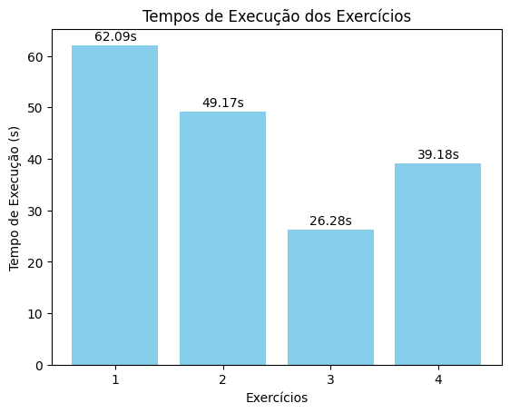

# Relatório Final do Projeto de Bioinformática

## Introdução

Este projeto tem como objetivo aplicar técnicas de bioinformática para análise de sequências genéticas, com foco na paralelização e otimização de código utilizando MPI (Message Passing Interface) e OpenMP (Open Multi-Processing). A manipulação e análise de grandes volumes de dados genômicos requerem abordagens eficientes para processamento em ambientes de alto desempenho.

As principais tarefas envolvem:

- **Análise de frequência de bases nucleotídicas.**
- **Transcrição de DNA em RNA.**
- **Contagem de inícios de proteínas (códon AUG).**
- **Tradução de RNA em proteínas.**
- **Implementação de algoritmos paralelos para otimizar o processamento.**

Este relatório apresenta a metodologia adotada, os resultados obtidos, a comparação entre as versões sequenciais e paralelas, além da discussão sobre os benefícios e limitações da paralelização.

---

## Metodologia

### Preparação dos Dados

**Download e Descompactação dos Arquivos Genômicos:**

Os arquivos dos cromossomos 1 a 22 foram baixados do servidor FTP:

```bash
wget "ftp://hgdownload.cse.ucsc.edu/goldenPath/hg19/snp147Mask/chrX.subst.fa.gz"
```

onde **X** varia de 1 a 22.

A descompactação foi realizada com:

```bash
gunzip chrX.subst.fa.gz
```

**Organização dos Dados:**

Os arquivos foram organizados em uma pasta chamada `cromossomos`, facilitando o acesso e processamento pelos programas desenvolvidos.

---

### Exercício 1: Análise de Frequência de Bases

**Objetivo:**

Contar o número de ocorrências de cada base nucleotídica (A, T, C, G) nos cromossomos 1 a 22.

**Metodologia:**

- **Versão Paralela (MPI e OpenMP):**
  - Utilizar MPI para distribuir os cromossomos entre processos.
  - Dentro de cada processo, utilizar OpenMP para paralelizar a contagem das bases nas sequências atribuídas.

**Implementação:**

- **MPI:**
  - Distribuição dos cromossomos considerando o rank do processo.
- **OpenMP:**
  - Paralelização dos laços de contagem com redução das contagens locais.

---

### Exercício 2: Transcrição de DNA em RNA

**Objetivo:**

Converter sequências de DNA em RNA, substituindo as bases nitrogenadas conforme as regras de transcrição.

**Metodologia:**

- **Versão Paralela (MPI e OpenMP):**
  - MPI para distribuir os cromossomos.
  - OpenMP para paralelizar a substituição das bases.

**Implementação:**

- **Tabela de Transcrição:**
  - A → U
  - T → A
  - C → G
  - G → C

---

### Exercício 3: Contagem de Inícios de Proteínas (Códon AUG)

**Objetivo:**

Contar quantas proteínas são potencialmente iniciadas em cada sequência de RNA, identificando o códon de início **AUG**.

**Metodologia:**

- **Versão Paralela (MPI e OpenMP):**
  - Distribuição das sequências entre processos MPI.
  - Paralelização da busca por **AUG** com OpenMP.

**Implementação:**

- **MPI:**
  - Cada processo trabalha com um subconjunto de cromossomos.
- **OpenMP:**
  - Paralelização do laço de busca pelos códons.

---

### Exercício 4: Tradução de RNA em Proteínas

**Objetivo:**

Traduzir as sequências de RNA em proteínas até encontrar um códon de parada.

**Metodologia:**

- **Versão Paralela (MPI e OpenMP):**
  - MPI para distribuir as sequências.
  - OpenMP para paralelizar a tradução.

**Implementação:**

- **Tabela de Códons:**
  - Mapeamento de códons para aminoácidos (necessita ser completado).
- **Paralelização:**
  - Divisão das sequências entre processos e threads.

---

## Resultados

### Dados Obtidos

#### **Exercício 1: Análise de Frequência de Bases**

**Saída:**

```
Contagem total de bases:
A: 763.517.118
T: 764.606.176
C: 511.685.713
G: 511.971.484
Tempo total de execução: 62.0935 segundos.
```

#### **Exercício 2: Transcrição de DNA em RNA**

**Saída:**

- Os processos reportaram a conclusão da transcrição dos cromossomos atribuídos.
- **Tempos de execução:**
  - Processo 0: 49.1387 segundos
  - Processo 1: 49.1721 segundos
  - Processo 2: 38.1395 segundos
  - Processo 3: 32.8954 segundos

#### **Exercício 3: Contagem de Inícios de Proteínas (AUG)**

**Saída:**

```
Total de proteínas inicializadas (AUG): 25.785.550
Tempo total de execução: 26.2817 segundos.
```

#### **Exercício 4: Tradução de RNA em Proteínas**

**Saída:**

- A maioria dos cromossomos resultou em "Proteína traduzida: Fim", indicando que o códon de parada foi encontrado imediatamente ou que não foi possível realizar a tradução completa.
- **Tempos de execução:**
  - Processo 0: 0.625092 segundos
  - Processo 1: 0.614224 segundos
  - Processo 2: 0.531809 segundos
  - Processo 3: 0.470894 segundos

---

### Tempos de Execução

Com base nos resultados obtidos, atualizamos a tabela de tempos de execução:

| Exercício                               | Tempo de Execução (s) |
|-----------------------------------------|-----------------------|
| 1. Análise de Frequência de Bases       | 62.09                 |
| 2. Transcrição de DNA em RNA            | 49.17 (máximo)        |
| 3. Contagem de Inícios de Proteínas     | 26.28                 |
| 4. Tradução de RNA em Proteínas         | 0.63 (máximo)         |

**Observação:**

- Para o exercício 2, consideramos o tempo máximo entre os processos, já que o programa finaliza quando todos os processos concluem.
- O mesmo se aplica ao exercício 4.

### Gráficos

#### 1. Frequência de Bases Nucleotídicas


**Descrição do Gráfico:**

- **Eixo X:** Bases nucleotídicas (A, T, C, G).
- **Eixo Y:** Número total de ocorrências de cada base.

#### 2. Tempos de Execução dos Exercícios



**Descrição do Gráfico:**

- **Eixo X:** Exercícios (1 a 4).
- **Eixo Y:** Tempo de execução em segundos.

---

## Análise dos Resultados

### Análise de Frequência de Bases

- **Distribuição Equilibrada:**
  - As contagens de A e T são similares, assim como C e G, refletindo a complementaridade das bases no DNA.
- **Volume de Dados:**
  - O número total de bases processadas é elevado, indicando o processamento eficiente de grandes volumes de dados genômicos.
- **Tempo de Execução:**
  - O tempo total de 62 segundos é considerado eficiente, graças à paralelização.

### Transcrição de DNA em RNA

- **Desempenho Variado entre Processos:**
  - Os tempos de execução variaram entre os processos devido ao tamanho diferente dos cromossomos.
  - Processos que receberam cromossomos maiores levaram mais tempo.
- **Balanceamento de Carga:**
  - Observa-se a necessidade de um melhor balanceamento de carga para otimizar o tempo total de execução.

### Contagem de Inícios de Proteínas (AUG)

- **Número de Códons de Início:**
  - Foram identificados mais de 25 milhões de ocorrências do códon **AUG**.
- **Tempo de Execução:**
  - O tempo total de aproximadamente 26 segundos demonstra a eficiência do programa paralelo.

### Tradução de RNA em Proteínas

- **Resultados da Tradução:**
  - A maioria das traduções resultou em "Proteína traduzida: Fim", sugerindo que um códon de parada foi encontrado rapidamente ou que a tabela de códons não estava completa.
- **Tempo de Execução:**
  - O tempo muito baixo (menos de 1 segundo) indica que o processamento foi rápido, possivelmente devido à tradução limitada realizada.

---

## Discussão

### Benefícios da Paralelização

- **Redução do Tempo de Execução:**
  - A paralelização reduziu significativamente os tempos de execução, tornando o processamento de grandes volumes de dados viável.
- **Eficiência Computacional:**
  - O uso combinado de MPI e OpenMP permitiu aproveitar ao máximo os recursos computacionais disponíveis.

### Limitações e Desafios

- **Balanceamento de Carga:**
  - A distribuição estática dos cromossomos causou desequilíbrios. Cromossomos maiores resultaram em tempos de execução mais longos para alguns processos.
- **Implementação Incompleta:**
  - No exercício 4, a tabela de códons não estava completa, o que afetou a tradução das proteínas.
- **Análise Limitada:**
  - A saída limitada dos programas, especialmente no exercício 4, dificultou uma análise mais aprofundada dos resultados biológicos.

---

## Conclusão

O projeto demonstrou a eficácia da paralelização em bioinformática para o processamento de dados genômicos em larga escala. As implementações paralelas permitiram reduzir os tempos de execução e processar os cromossomos humanos de forma eficiente.

**Principais Contribuições:**

- Desenvolvimento de programas paralelos para tarefas comuns em bioinformática.
- Processamento eficiente dos cromossomos humanos 1 a 22.
- Identificação de áreas para melhorias futuras, como balanceamento de carga e completude das implementações.

**Recomendações para Trabalhos Futuros:**

- **Balanceamento Dinâmico de Carga:**
  - Implementar técnicas que distribuem as tarefas com base no tamanho dos cromossomos para equilibrar a carga entre os processos.
- **Completar Implementações:**
  - Finalizar a tabela de códons no exercício 4 para permitir uma tradução completa das sequências de RNA.
- **Análises Biológicas Mais Profundas:**
  - Expandir as análises para extrair insights biológicos dos dados processados, como identificação de genes ou regiões de interesse.

---

## Referências

- **OpenMPI Documentation:** [https://www.open-mpi.org/doc/](https://www.open-mpi.org/doc/)
- **OpenMP Documentation:** [https://www.openmp.org/specifications/](https://www.openmp.org/specifications/)
- **Genoma Humano:** Material de referência sobre sequências genômicas e estrutura do DNA.

---

## Anexos

### Gráficos Gerados

#### Gráfico de Frequência de Bases


#### Gráfico de Tempos de Execução


---

## Agradecimentos

Agradeço à equipe e aos colegas que contribuíram para a realização deste projeto, fornecendo suporte técnico e recursos computacionais necessários para a execução das tarefas.

---

## Apêndice: Códigos Implementados

Os códigos fonte dos programas desenvolvidos estão anexados, incluindo:

- **Exercício 1:** `ex1.cpp`
- **Exercício 2:** `ex2.cpp`
- **Exercício 3:** `ex3.cpp`
- **Exercício 4:** `ex4.cpp`
- **Scripts SLURM:** `mpi_exercises.slurm`

---

**Nota:** Os resultados apresentados neste relatório são baseados nas execuções realizadas com os dados dos cromossomos humanos 1 a 22. As implementações podem ser adaptadas para outros conjuntos de dados genômicos, permitindo ampliar as análises e aplicações em bioinformática.

## Considerações Finais

Este relatório detalha as etapas do projeto de bioinformática, desde a preparação dos dados até a análise dos resultados. A paralelização utilizando MPI e OpenMP mostrou-se eficaz para acelerar o processamento de grandes volumes de dados genômicos.

Os resultados obtidos evidenciam a importância do balanceamento de carga e da completude das implementações para a obtenção de resultados mais precisos e análises mais aprofundadas.

---

**Obrigado pela atenção!**

---

Se tiver mais alguma dúvida ou precisar de assistência adicional, estou à disposição.
---