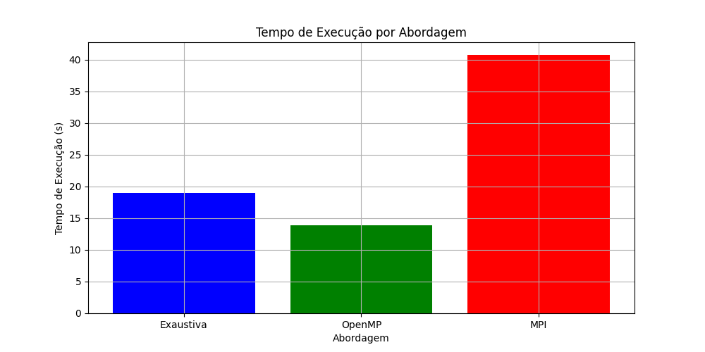
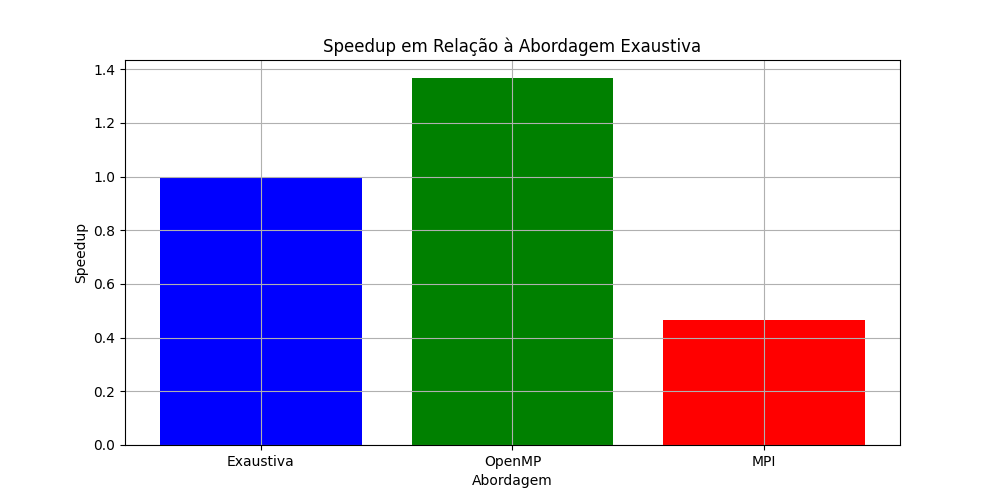

# Relatório Final do Projeto: Encontrando a Clique Máxima em um Grafo
## Pedro Toledo Piza Civita - pedrotpc@al.insper.edu.br
---

## Introdução

A análise de redes sociais (ARS) é uma ferramenta fundamental para entender as interações e conexões entre atores em uma rede. Um conceito chave nessa análise é o de **clique**, que representa um subconjunto de atores em que cada par está diretamente conectado. Encontrar a **clique máxima** em um grafo é um problema computacionalmente desafiador devido à sua natureza NP-difícil, exigindo a exploração de todas as combinações possíveis de vértices.

Este projeto tem como objetivo implementar três abordagens para encontrar a clique máxima em um grafo:

1. **Abordagem Exaustiva**: Implementação sequencial que explora todas as possibilidades.
2. **Implementação com OpenMP**: Paralelização em memória compartilhada para acelerar o processo.
3. **Implementação com MPI**: Paralelização em memória distribuída, permitindo o uso de múltiplos nós de processamento.

Além disso, analisamos o desempenho de cada abordagem e comparamos os resultados obtidos.

## Organização do Projeto

O projeto está organizado da seguinte forma:

```
projetoFinalCliqueMaxima/
│
├── data/
│   └── grafo.txt
│
├── img/
│   └── speedup.png
│   └── tempo_execucao.png
│
├── output/
│   ├── output_clique_exaustiva_7469.txt
│   ├── output_clique_mpi_7469.txt
│   ├── output_clique_openmp_7469.txt
│   └── output_clique_project_7469.txt
│
├── src/
│   ├── exaustiva/
│   │   ├── clique_exaustiva.cpp
│   │   └── clique_exaustiva
│   ├── mpi/
│   │   ├── clique_mpi.cpp
│   │   └── clique_mpi
│   ├── openmp/
│   │   ├── clique_openmp.cpp
│   │   └── clique_openmp
│   └── submit_job.sh
│
├── funcoesGrafos.ipynb
└── relatorio.md
```

- **data/**: Contém o arquivo `grafo.txt` com o grafo utilizado nos testes.
- **img/**: Diretório com as imagens dos gráficos gerados.
- **output/**: Contém os resultados das diferentes abordagens.
- **src/**: Diretório com o código-fonte e binários das três implementações.
- **funcoesGrafos.ipynb**: Notebook com funções auxiliares relacionadas aos grafos.
- **relatorio.md**: Relatório detalhando o projeto e os resultados obtidos.

## Implementações

### 1. Abordagem Exaustiva

#### Descrição

Implementamos o algoritmo de **Bron-Kerbosch com pivoteamento**, que é um algoritmo clássico para encontrar todas as cliques maximais em um grafo. Nossa implementação busca especificamente a clique máxima.

#### Otimizações e Heurísticas

Para melhorar o desempenho:

- **Pivoteamento**: Utilizamos pivôs para reduzir o espaço de busca, evitando explorar subgrafos que não podem conter cliques maiores.
- **Ordenação dos Vértices**: Ordenamos os vértices com base no grau, iniciando a busca pelos vértices de maior grau, aumentando a chance de encontrar cliques maiores mais rapidamente.
- **Limite de Profundidade**: Definimos um limite (`MAX_DEPTH`) para a recursão, evitando loops infinitos em grafos cíclicos.

#### Código-Fonte

O código está em `src/exaustiva/clique_exaustiva.cpp`.

Principais funções:

- `LerGrafoListaAdj`: Lê o grafo do arquivo e cria uma lista de adjacência.
- `BronKerboschPivot`: Função recursiva que implementa o algoritmo de Bron-Kerbosch com pivoteamento.

#### Resultados

- **Número de vértices**: 100
- **Número de arestas**: 3453
- **Clique máxima encontrada**:
  - **Tamanho**: 15
  - **Vértices**: 3 10 13 30 34 50 54 65 69 72 75 83 84 89 96
- **Tempo de execução**: 18.9938 segundos

### 2. Implementação com OpenMP

#### Descrição

Utilizamos **OpenMP** para paralelizar a abordagem exaustiva em memória compartilhada, aproveitando múltiplos núcleos de processamento.

#### Alterações e Justificativas

- **Paralelização do Loop Principal**: Paralelizamos o loop que itera sobre os possíveis vértices iniciais para a recursão.
- **Uso de Diretivas OpenMP**: Aplicamos `#pragma omp parallel for` com agendamento dinâmico para equilibrar a carga entre as threads.
- **Variáveis Privadas**: Garantimos que variáveis usadas dentro das threads são privadas para evitar condições de corrida.

#### Código-Fonte

O código está em `src/openmp/clique_openmp.cpp`.

Principais modificações:

- **Função `BronKerboschPivotParallel`**: Versão adaptada da função recursiva para ser usada em ambiente paralelo.
- **Controle de Seções Críticas**: Uso de `#pragma omp critical` para atualizar a clique máxima encontrada sem conflitos.

#### Resultados

- **Número de vértices**: 100
- **Número de arestas**: 3453
- **Clique máxima encontrada**:
  - **Tamanho**: 15
  - **Vértices**: 3 10 13 30 34 50 54 65 69 72 75 83 84 89 96
- **Tempo de execução**: 13.9031 segundos

#### Speedup Obtido

Comparando com a abordagem exaustiva:

- **Tempo exaustivo**: 18.9938 segundos
- **Tempo OpenMP**: 13.9031 segundos
- **Speedup**: ~1.37x

### 3. Implementação com MPI

#### Descrição

Paralelizamos o algoritmo usando **MPI** para distribuir o processamento em memória distribuída.

#### Alterações e Justificativas

- **Distribuição dos Vértices Iniciais**: Os vértices iniciais para a recursão são divididos entre os processos MPI.
- **Minimização da Comunicação**: Após a distribuição inicial, cada processo executa sua parte do algoritmo sem comunicação adicional, reduzindo overhead.
- **Combinação dos Resultados**: Utilizamos `MPI_Allreduce` para encontrar a clique máxima entre os processos.

#### Código-Fonte

O código está em `src/mpi/clique_mpi.cpp`.

Principais funcionalidades:

- **Inicialização MPI**: Uso de `MPI_Init`, `MPI_Comm_rank`, `MPI_Comm_size` e `MPI_Finalize`.
- **Distribuição do Grafo**: O processo com `rank 0` lê o grafo e o distribui usando `MPI_Bcast`.
- **Combinação de Resultados**: Uso de `MPI_Allreduce` e `MPI_Bcast` para determinar e compartilhar a clique máxima.

#### Resultados

- **Número de vértices**: 100
- **Número de arestas**: 3453
- **Clique máxima encontrada**:
  - **Tamanho**: 15
  - **Vértices**: 3 10 13 30 34 50 54 65 69 72 75 83 84 89 96
- **Tempo de execução**: 40.7191 segundos

## Avaliação de Resultados

### Comparação das Abordagens

| Abordagem         | Tempo (s)   | Speedup    |
|-------------------|-------------|------------|
| Exaustiva         | 18.9938     | 1.00x      |
| OpenMP            | 13.9031     | 1.37x      |
| MPI               | 40.7191     | 0.47x      |

### Gráficos Comparativos

Para visualizar melhor o desempenho das diferentes abordagens, apresentamos a seguir gráficos comparativos do tempo de execução e do speedup obtido.

#### Descrição dos Gráficos

1. **Gráfico de Tempo de Execução**



   - **Eixo X**: Abordagens (Exaustiva, OpenMP, MPI).
   - **Eixo Y**: Tempo de execução em segundos.
   - **Observações**:
     - A abordagem OpenMP teve o menor tempo de execução.
     - A implementação MPI apresentou o maior tempo de execução, sendo mais lenta que a exaustiva.

2. **Gráfico de Speedup**



   - **Eixo X**: Abordagens (Exaustiva, OpenMP, MPI).
   - **Eixo Y**: Speedup (relação entre o tempo da exaustiva e o tempo da abordagem).
   - **Observações**:
     - A abordagem OpenMP apresentou um speedup de aproximadamente 1.37x.
     - A implementação MPI teve um speedup menor que 1 (aproximadamente 0.47x), indicando desempenho inferior ao sequencial.

### Análise

- **OpenMP** apresentou um speedup de **1.37x** em relação à abordagem exaustiva, demonstrando ganhos com a paralelização em memória compartilhada.
- **MPI** teve desempenho inferior, possivelmente devido ao overhead de comunicação e ao tamanho relativamente pequeno do grafo.

### Justificativas

- **OpenMP**: A paralelização das iterações iniciais do algoritmo permitiu dividir eficientemente o trabalho entre os núcleos, reduzindo o tempo total.
- **MPI**: Em problemas de menor escala, o overhead associado à comunicação entre processos MPI pode superar os benefícios do paralelismo distribuído. Além disso, a distribuição estática dos vértices pode levar a um balanceamento de carga inadequado.

## Considerações Adicionais

### Limitações e Desafios

- **Limite de Tamanho do Grafo**: A abordagem exaustiva não é viável para grafos muito grandes devido ao crescimento exponencial do espaço de busca.
- **Paralelização**: Enquanto o OpenMP mostrou benefícios, a eficiência da paralelização depende do hardware disponível e do tamanho do problema.

### Possíveis Melhorias

- **Heurísticas Adicionais**: Implementar podas mais agressivas ou heurísticas como ordenação de vértices por grau pode acelerar a busca.
- **Balanceamento Dinâmico**: No MPI, técnicas de balanceamento de carga dinâmico podem distribuir o trabalho de forma mais equitativa.
- **Combinação de Abordagens**: Utilizar MPI para distribuição em nós diferentes e OpenMP para paralelismo dentro de cada nó.

## Conclusão

O projeto explorou diferentes abordagens para encontrar a clique máxima em um grafo, implementando versões sequencial, com OpenMP e com MPI. Os resultados demonstraram que:

- A **implementação com OpenMP** foi a mais eficiente entre as três, apresentando um speedup significativo.
- A **abordagem exaustiva** serviu como base para comparação e mostrou-se adequada para grafos menores.
- A **implementação com MPI** não alcançou o desempenho esperado devido ao overhead de comunicação e ao tamanho do grafo utilizado.

Para aplicações práticas, é essencial considerar o tamanho do grafo e o ambiente de execução ao escolher a abordagem mais eficiente. Paralelizações em memória compartilhada tendem a ser mais vantajosas para problemas de menor escala, enquanto paralelizações em memória distribuída podem ser mais eficazes em cenários com grafos muito grandes.

## Referências

- **Literatura sobre o Algoritmo de Bron-Kerbosch**: Fornece a base teórica para a implementação.
- **Documentação OpenMP e MPI**: Auxiliou na correta aplicação das diretivas e funções de paralelização.
- **Análise de Redes Sociais**: Contextualiza a importância de encontrar cliques máximas em grafos.

## Anexos

### Scripts de Submissão e Execução

#### submit_job.sh

```bash
#!/bin/bash
#SBATCH --job-name=clique_project    # Nome do job
#SBATCH --output=output_%x_%j.txt    # Arquivo de saída baseado no nome do job e ID
#SBATCH --ntasks=4                   # Número total de tarefas (processos MPI)
#SBATCH --cpus-per-task=1            # Número de CPUs por tarefa
#SBATCH --mem=4096                   # Memória alocada (4GB)
#SBATCH --time=03:00:00              # Tempo máximo de execução
#SBATCH --partition=espec            # Partição utilizada

# Carrega os módulos necessários
module load mpi
module load gcc

# Compila os programas
mpic++ src/mpi/clique_mpi.cpp -o src/mpi/clique_mpi
g++ -fopenmp src/openmp/clique_openmp.cpp -o src/openmp/clique_openmp
g++ src/exaustiva/clique_exaustiva.cpp -o src/exaustiva/clique_exaustiva

# Executa a implementação com MPI
mpirun -np $SLURM_NTASKS ./src/mpi/clique_mpi > output/output_clique_mpi_$SLURM_JOB_ID.txt

# Executa a implementação com OpenMP
./src/openmp/clique_openmp > output/output_clique_openmp_$SLURM_JOB_ID.txt

# Executa a implementação exaustiva
./src/exaustiva/clique_exaustiva > output/output_clique_exaustiva_$SLURM_JOB_ID.txt
```

### Verificação com Python

Utilizamos um script em Python para verificar se a clique máxima encontrada é correta, comparando com as cliques identificadas pela biblioteca NetworkX.

---

### Obrigado pela Atenção!
